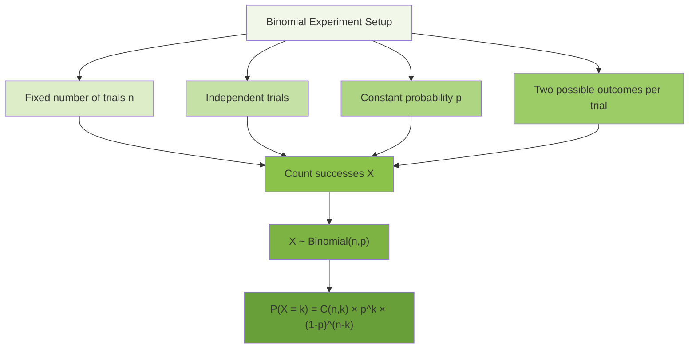
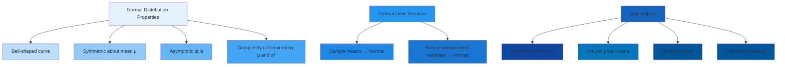

# C-1: Fundamental Probability Distributions

#### Discrete Probability Distributions

##### Bernoulli Distribution

##### Binomial Distribution

##### Geometric Distribution

##### Negative Binomial Distribution

##### Multinomial Distribution

##### Poisson Distribution

#### Continuous Probability Distributions

##### Uniform Distribution

##### Normal Distribution

##### Lognormal Distribution

##### Exponential Distribution

---

## #### Discrete Probability Distributions

Discrete probability distributions model random variables that can take on a countable number of distinct values. These
distributions are fundamental in modeling scenarios involving counting, success/failure outcomes, and discrete events.

### ##### Bernoulli Distribution

The Bernoulli distribution represents the simplest random experiment: a single trial with exactly two possible outcomes,
typically labeled as "success" and "failure." This distribution forms the foundation for many other discrete
distributions.

**Mathematical Definition:** A random variable $X$ follows a Bernoulli distribution with parameter $p$ if:

$$P(X = k) = \begin{cases} 1-p & \text{if } k = 0 \ p & \text{if } k = 1 \ 0 & \text{otherwise} \end{cases}$$

where $0 \leq p \leq 1$ represents the probability of success.

**Key Properties:**

- **Mean**: $E[X] = p$
- **Variance**: $\text{Var}(X) = p(1-p)$
- **Support**: ${0, 1}$

**Example Application:** Consider flipping a fair coin where "heads" represents success. Here $p = 0.5$, so:

- $P(X = 1) = 0.5$ (probability of heads)
- $P(X = 0) = 0.5$ (probability of tails)
- $E[X] = 0.5$, $\text{Var}(X) = 0.25$

**Real-World Applications:**

- Quality control testing (defective vs. non-defective items)
- Medical diagnosis (positive vs. negative test results)
- Marketing response (customer responds vs. doesn't respond)

### ##### Binomial Distribution

The binomial distribution extends the Bernoulli distribution to multiple independent trials. It models the number of
successes in a fixed number of independent Bernoulli trials.

**Mathematical Definition:** A random variable $X$ follows a binomial distribution with parameters $n$ and $p$, denoted
$X \sim \text{Binomial}(n,p)$, if:

$$\large P(X = k) = \binom{n}{k} p^k (1-p)^{n-k}$$

for $k = 0, 1, 2, \ldots, n$, where $\binom{n}{k} = \frac{n!}{k!(n-k)!}$.

**Key Properties:**

- **Mean**: $E[X] = np$
- **Variance**: $\text{Var}(X) = np(1-p)$
- **Support**: ${0, 1, 2, \ldots, n}$

**Example Application:** A pharmaceutical company tests a new drug on 20 patients, where each patient has a 0.7
probability of showing improvement. Let $X$ be the number of patients showing improvement.

Here $n = 20$, $p = 0.7$:

- $P(X = 15) = \binom{20}{15} (0.7)^{15} (0.3)^5 \approx 0.179$
- $E[X] = 20 \times 0.7 = 14$ patients expected to improve
- $\text{Var}(X) = 20 \times 0.7 \times 0.3 = 4.2$

### ##### Geometric Distribution

The geometric distribution models the number of trials needed to achieve the first success in a sequence of independent
Bernoulli trials.

**Mathematical Definition:** A random variable $X$ follows a geometric distribution with parameter $p$, denoted
$X \sim \text{Geometric}(p)$, if:

$$P(X = k) = (1-p)^{k-1} p$$

for $k = 1, 2, 3, \ldots$, where $p$ is the probability of success on each trial.

**Key Properties:**

- **Mean**: $E[X] = \frac{1}{p}$
- **Variance**: $\text{Var}(X) = \frac{1-p}{p^2}$
- **Support**: ${1, 2, 3, \ldots}$
- **Memoryless Property**: $P(X > s + t \mid X > s) = P(X > t)$

**Example Application:** A salesperson calls potential customers until making their first sale. If each call has a 0.2
probability of resulting in a sale:

- $P(X = 3) = (0.8)^2 \times 0.2 = 0.128$ (first sale on third call)
- $E[X] = \frac{1}{0.2} = 5$ calls expected on average
- $\text{Var}(X) = \frac{0.8}{(0.2)^2} = 20$

### ##### Negative Binomial Distribution

The negative binomial distribution generalizes the geometric distribution by modeling the number of trials needed to
achieve exactly $r$ successes.

**Mathematical Definition:** A random variable $X$ follows a negative binomial distribution with parameters $r$ and $p$,
if:

$$\large P(X = k) = \binom{k-1}{r-1} p^r (1-p)^{k-r}$$

for $k = r, r+1, r+2, \ldots$, where $r$ is the target number of successes.

**Key Properties:**

- **Mean**: $E[X] = \frac{r}{p}$
- **Variance**: $\text{Var}(X) = \frac{r(1-p)}{p^2}$
- **Support**: ${r, r+1, r+2, \ldots}$

**Example Application:** A researcher needs to find 5 participants with a rare genetic condition. If each person tested
has a 0.1 probability of having the condition:

- Expected number of people to test: $E[X] = \frac{5}{0.1} = 50$
- $P(X = 60) = \binom{59}{4} (0.1)^5 (0.9)^{55}$

### ##### Multinomial Distribution

The multinomial distribution extends the binomial distribution to experiments with more than two possible outcomes per
trial.

**Mathematical Definition:** For $n$ independent trials where each trial can result in one of $k$ outcomes with
probabilities $p_1, p_2, \ldots, p_k$ (where $\sum_{i=1}^k p_i = 1$), the joint probability is:

$$\large P(X_1 = x_1, \ldots, X_k = x_k) = \frac{n!}{x_1! x_2! \cdots x_k!} p_1^{x_1} p_2^{x_2} \cdots p_k^{x_k}$$

where $X_i$ is the number of times outcome $i$ occurs, and $\sum_{i=1}^k x_i = n$.

**Key Properties:**

- **Mean**: $E[X_i] = np_i$
- **Variance**: $\text{Var}(X_i) = np_i(1-p_i)$
- **Covariance**: $\text{Cov}(X_i, X_j) = -np_ip_j$ for $i \neq j$

**Example Application:** Rolling a six-sided die 12 times, where each face has probability $\frac{1}{6}$:

- Expected count for each face: $E[X_i] = 12 \times \frac{1}{6} = 2$
- Probability of getting exactly 2 of each face: $P = \frac{12!}{2!^6} \left(\frac{1}{6}\right)^{12}$

### ##### Poisson Distribution

The Poisson distribution models the number of events occurring in a fixed interval of time or space, when events occur
independently at a constant average rate.

**Mathematical Definition:** A random variable $X$ follows a Poisson distribution with parameter $\lambda > 0$, denoted
$X \sim \text{Poisson}(\lambda)$, if:

$$P(X = k) = \frac{\lambda^k e^{-\lambda}}{k!}$$

for $k = 0, 1, 2, \ldots$, where $\lambda$ represents the average rate of occurrence.

**Key Properties:**

- **Mean**: $E[X] = \lambda$
- **Variance**: $\text{Var}(X) = \lambda$
- **Support**: ${0, 1, 2, \ldots}$
- **Additive Property**: If $X_1 \sim \text{Poisson}(\lambda_1)$ and $X_2 \sim \text{Poisson}(\lambda_2)$ are
  independent, then $X_1 + X_2 \sim \text{Poisson}(\lambda_1 + \lambda_2)$

**Example Application:** A call center receives an average of 3 calls per minute. The number of calls in any given
minute follows $\text{Poisson}(3)$:

- $P(X = 2) = \frac{3^2 e^{-3}}{2!} = \frac{9e^{-3}}{2} \approx 0.224$
- $P(X = 0) = e^{-3} \approx 0.050$ (probability of no calls)
- Expected calls per minute: $E[X] = 3$

## #### Continuous Probability Distributions

Continuous probability distributions model random variables that can take on any value within a continuous range. These
distributions are characterized by probability density functions rather than probability mass functions.

### ##### Uniform Distribution

The uniform distribution represents a scenario where all outcomes in a given interval are equally likely. It serves as
the foundation for understanding more complex continuous distributions.

**Mathematical Definition:** A random variable $X$ follows a continuous uniform distribution on interval $[a,b]$,
denoted $X \sim \text{Uniform}(a,b)$, with probability density function:

$$f(x) = \begin{cases} \frac{1}{b-a} & \text{if } a \leq x \leq b \ 0 & \text{otherwise} \end{cases}$$

**Key Properties:**

- **Mean**: $E[X] = \frac{a+b}{2}$
- **Variance**: $\text{Var}(X) = \frac{(b-a)^2}{12}$
- **Support**: $[a,b]$
- **Cumulative Distribution Function**: $F(x) = \frac{x-a}{b-a}$ for $a \leq x \leq b$

**Example Application:** A bus arrives randomly between 2:00 PM and 2:10 PM. If $X$ represents arrival time in minutes
after 2:00 PM, then $X \sim \text{Uniform}(0,10)$:

- $f(x) = \frac{1}{10}$ for $0 \leq x \leq 10$
- Expected arrival time: $E[X] = 5$ minutes after 2:00 PM
- $P(X \leq 3) = \frac{3}{10} = 0.3$ (probability of arriving within first 3 minutes)

### ##### Normal Distribution

The normal distribution, also known as the Gaussian distribution, is arguably the most important probability
distribution in statistics due to the Central Limit Theorem and its widespread applicability.

**Mathematical Definition:** A random variable $X$ follows a normal distribution with parameters $\mu$ and $\sigma^2$,
denoted $X \sim \mathcal{N}(\mu, \sigma^2)$, with probability density function:

$$\large f(x) = \frac{1}{\sigma\sqrt{2\pi}} \exp\left(-\frac{(x-\mu)^2}{2\sigma^2}\right)$$

for $-\infty < x < \infty$.

**Key Properties:**

- **Mean**: $E[X] = \mu$
- **Variance**: $\text{Var}(X) = \sigma^2$
- **Support**: $(-\infty, \infty)$
- **Symmetry**: Symmetric about $\mu$
- **Empirical Rule**: Approximately 68% of values lie within $\mu \pm \sigma$, 95% within $\mu \pm 2\sigma$, and 99.7%
  within $\mu \pm 3\sigma$

**Standard Normal Distribution:** When $\mu = 0$ and $\sigma = 1$, we have the standard normal distribution
$Z \sim \mathcal{N}(0,1)$ with:

$$\phi(z) = \frac{1}{\sqrt{2\pi}} e^{-z^2/2}$$

**Example Application:** Human heights in a population follow $\mathcal{N}(170, 10^2)$ cm:

- $P(160 < X < 180) \approx 0.68$ (within one standard deviation)
- To find $P(X > 175)$: standardize $Z = \frac{175-170}{10} = 0.5$, then $P(Z > 0.5) \approx 0.309$

### ##### Lognormal Distribution

The lognormal distribution models variables whose logarithm follows a normal distribution. It's particularly useful for
modeling positive-valued quantities that exhibit right skewness.

**Mathematical Definition:** A random variable $X$ follows a lognormal distribution if
$\ln(X) \sim \mathcal{N}(\mu, \sigma^2)$. The probability density function is:

$$\large f(x) = \frac{1}{x\sigma\sqrt{2\pi}} \exp\left(-\frac{(\ln x - \mu)^2}{2\sigma^2}\right)$$

for $x > 0$.

**Key Properties:**

- **Mean**: $E[X] = e^{\mu + \sigma^2/2}$
- **Variance**: $\text{Var}(X) = (e^{\sigma^2} - 1)e^{2\mu + \sigma^2}$
- **Support**: $(0, \infty)$
- **Relationship**: If $X \sim \text{Lognormal}(\mu, \sigma^2)$, then $\ln(X) \sim \mathcal{N}(\mu, \sigma^2)$

**Example Application:** Stock prices often follow lognormal distributions. If daily returns are normally distributed,
then stock prices follow a lognormal distribution. For a stock with $\mu = 0.05$ and $\sigma = 0.2$:

- Expected price ratio: $E[X] = e^{0.05 + 0.2^2/2} = e^{0.07} \approx 1.073$
- This represents a 7.3% expected increase

### ##### Exponential Distribution

The exponential distribution models the time between events in a Poisson process. It's the continuous analog of the
geometric distribution and exhibits the memoryless property.

**Mathematical Definition:** A random variable $X$ follows an exponential distribution with rate parameter
$\lambda > 0$, denoted $X \sim \text{Exponential}(\lambda)$, with probability density function:

$$f(x) = \lambda e^{-\lambda x}$$

for $x \geq 0$.

**Key Properties:**

- **Mean**: $E[X] = \frac{1}{\lambda}$
- **Variance**: $\text{Var}(X) = \frac{1}{\lambda^2}$
- **Support**: $[0, \infty)$
- **Memoryless Property**: $P(X > s + t \mid X > s) = P(X > t)$
- **Cumulative Distribution Function**: $F(x) = 1 - e^{-\lambda x}$ for $x \geq 0$

**Example Application:** The time between customer arrivals at a service counter follows $\text{Exponential}(0.5)$
(arrivals every 2 minutes on average):

- $f(x) = 0.5e^{-0.5x}$
- Expected time between arrivals: $E[X] = \frac{1}{0.5} = 2$ minutes
- $P(X > 3) = e^{-0.5 \times 3} = e^{-1.5} \approx 0.223$

**Connection to Poisson Process:** If events occur according to a Poisson process with rate $\lambda$, then the time
between consecutive events follows $\text{Exponential}(\lambda)$.

```mermaid
graph TD
    A["Probability Distributions Summary"] --> B["Discrete Distributions"]
    A --> C["Continuous Distributions"]

    B --> D["Bernoulli: Single trial"]
    B --> E["Binomial: Fixed trials"]
    B --> F["Geometric: First success"]
    B --> G["Negative Binomial: r successes"]
    B --> H["Multinomial: Multiple outcomes"]
    B --> I["Poisson: Events in interval"]

    C --> J["Uniform: Equal likelihood"]
    C --> K["Normal: Bell curve"]
    C --> L["Lognormal: Right skewed"]
    C --> M["Exponential: Waiting times"]

    N["Key Relationships"] --> O["Bernoulli → Binomial"]
    N --> P["Geometric → Negative Binomial"]
    N --> Q["Binomial → Poisson (limit)"]
    N --> R["Poisson Process → Exponential"]
    N --> S["Normal → Lognormal (transformation)"]

    style A fill:#FFF3E0
    style B fill:#FFE0B2
    style C fill:#FFCC80
    style D fill:#FFB74D
    style E fill:#FFA726
    style F fill:#FF9800
    style G fill:#FB8C00
    style H fill:#F57C00
    style I fill:#EF6C00
    style J fill:#E65100
    style K fill:#FF5722
    style L fill:#D84315
    style M fill:#BF360C
    style N fill:#F3E5F5
    style O fill:#E1BEE7
    style P fill:#CE93D8
    style Q fill:#BA68C8
    style R fill:#AB47BC
    style S fill:#9C27B0
```

## Summary and Applications

These ten probability distributions form the foundation of statistical modeling and analysis. Each distribution has
specific characteristics that make it suitable for particular types of real-world phenomena:

**Discrete distributions** are essential for counting processes, quality control, and modeling success/failure
scenarios. The progression from Bernoulli to binomial to multinomial shows how simple concepts can be extended to more
complex situations.

**Continuous distributions** model measurements and continuous phenomena. The normal distribution's central role in
statistics cannot be overstated, while specialized distributions like exponential and lognormal serve specific modeling
needs.

Understanding these distributions enables practitioners to choose appropriate models for their data, perform accurate
statistical inference, and make informed decisions based on probabilistic reasoning. The mathematical relationships
between these distributions also provide deep insights into the underlying structure of random phenomena.
