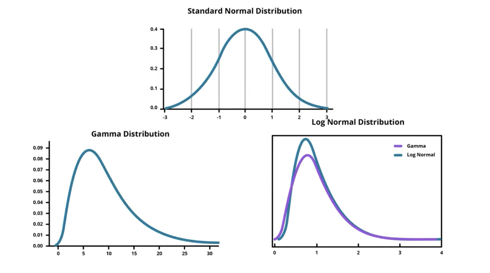
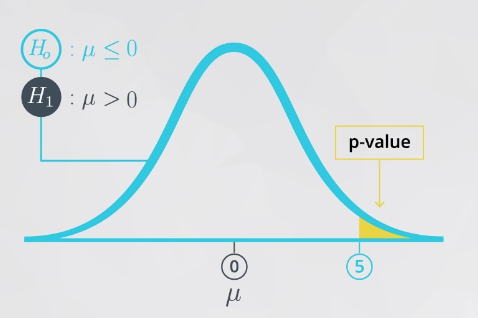
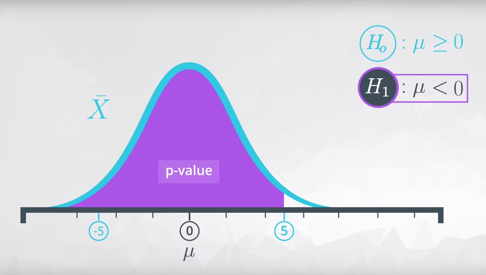
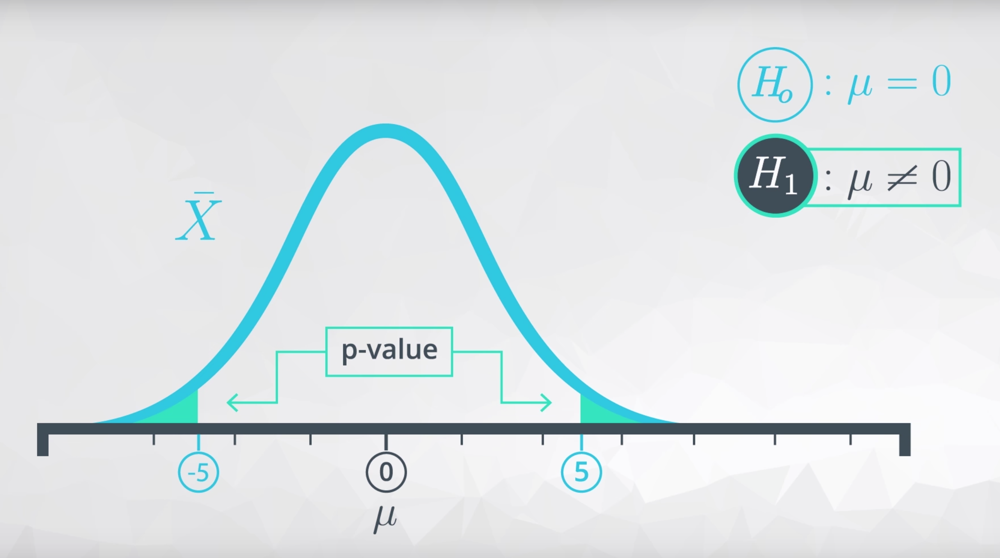

# CHAPTER 3: PROBABILITY 

This repository contains notes and examples for various statistical concepts used in data analysis.


# Understanding Sensitivity and Specificity in Medical Testing

In medical testing and diagnostic procedures, two crucial metrics help us evaluate the performance of a test: sensitivity and specificity. These concepts are fundamental in understanding how well a test can identify both positive and negative cases.

## Sensitivity (True Positive Rate)

Sensitivity measures the proportion of actual positive cases that are correctly identified. In other words, it answers the question: "If a person has the disease, how likely is the test to detect it?"

**Formula:**
```
Sensitivity = True Positives / (True Positives + False Negatives)
```

### Example of Sensitivity

Let's consider a COVID-19 testing scenario with 100 people who actually have COVID-19:
- 90 people test positive (True Positives)
- 10 people test negative (False Negatives)

Sensitivity = 90 / (90 + 10) = 90%

This means the test correctly identifies 90% of people who actually have COVID-19.

## Specificity (True Negative Rate)

Specificity measures the proportion of actual negative cases that are correctly identified. It answers the question: "If a person doesn't have the disease, how likely is the test to give a negative result?"

**Formula:**
```
Specificity = True Negatives / (True Negatives + False Positives)
```

### Example of Specificity

Consider testing 100 people who don't have COVID-19:
- 95 people test negative (True Negatives)
- 5 people test positive (False Positives)

Specificity = 95 / (95 + 5) = 95%

This means the test correctly identifies 95% of people who don't have COVID-19.

## Real-World Example: Mammogram Screening

Let's look at a real-world example of mammogram screening for breast cancer:

Suppose we have 1000 women:
- 100 have breast cancer
- 900 don't have breast cancer

The mammogram test results show:
- Of the 100 women with cancer:
  - 90 test positive (True Positives)
  - 10 test negative (False Negatives)
- Of the 900 women without cancer:
  - 855 test negative (True Negatives)
  - 45 test positive (False Positives)

**Calculations:**
- Sensitivity = 90/100 = 90%
- Specificity = 855/900 = 95%

## Trade-off Between Sensitivity and Specificity

There's often a trade-off between sensitivity and specificity:
- High sensitivity: Fewer false negatives but more false positives
- High specificity: Fewer false positives but more false negatives

The choice between prioritizing sensitivity or specificity depends on the context:
- For screening tests (like cancer screening), high sensitivity is crucial to not miss cases
- For confirmatory tests, high specificity is important to avoid false alarms

## Summary Table

| Metric | What it Measures | Formula | When it's Important |
|--------|------------------|---------|-------------------|
| Sensitivity | Ability to detect positive cases | TP/(TP+FN) | Screening tests, where missing a case is costly |
| Specificity | Ability to detect negative cases | TN/(TN+FP) | Confirmatory tests, where false alarms are costly |

## Practical Applications

1. **Disease Screening Programs:**
   - High sensitivity tests are used for initial screening
   - High specificity tests are used for confirmation

2. **Quality Control:**
   - Manufacturing defect detection
   - Food safety testing

3. **Security Systems:**
   - Airport security screening
   - Fraud detection systems

Understanding these metrics helps in:
- Choosing appropriate tests for specific situations
- Interpreting test results correctly
- Making informed decisions about testing procedures


Here's the markdown table based on the cases from the video:

| Case | Probability | Key Term |
|------|------------|----------|
| P(Cancer) | 0.01 | |
| P(¬Cancer) | 0.99 | |
| P(Positive\|Cancer) | 0.9 | Sensitivity |
| P(Negative\|¬Cancer) | 0.9 | Specificity |

This table shows:
1. Prior probability of having cancer (1%)
2. Prior probability of not having cancer (99%)
3. Sensitivity - probability of testing positive given you have cancer (90%)
4. Specificity - probability of testing negative given you don't have cancer (90%)

### Cancer Probabilities

| Case | Probability | Key Term |
|------|------------|----------|
| P(C) | 0.01 | Prior Probability |
| P(Pos\|C) | 0.9 | Sensitivity |
| P(Neg\|¬C) | 0.9 | Specificity |

## Visual Representation


<br>


<br>

Yellow Circle is for the case when the cancer test is positive irrespectively of the cancer status. Menaing it includes the cases when the test is positive but person doesn't have the cancer.


Yellow Circle = P(C&Pos) + P(¬C&Pos) =P(Cancer|Positive) + P(¬Cancer| Positive)


Without calculating it mathematically, let's estimate the answer here.

First, we know that only 1% of people have cancer regardless of the test being positive or negative. Imagine someone has already tested positive, the probability of that person having cancer will be higher than 1%. But how much higher?

Essentially, the quiz asks you to solve the probability of P(C|Pos).

From conditional probability theory, we know that

P(C|Pos) = P(C&Pos) / P(Pos) = P(C&Pos) / [P(C&Pos) + P(
¬
¬C&Pos)],

which is the ratio of people who have cancer and also test positive to people who test positive whether they have cancer or not. This ratio will be quite small because the majority (99%) of people don't have cancer, which means the number of people who test positive and have cancer (P(C&Pos)) is relatively small compared to the number of people who test positive but don't have cancer (P(
¬
¬C&Pos)). So the ratio could not be as high as 90%.

Based on the estimation and the 3 choices above, we can say that P(C|Pos) is higher than 1% and below 90%. So only 8% makes sense. 


Bayes Theorem

P(C|Pos) = P(Pos|C) * P(C) / P(Pos)

Prior Probability * Test Evidence = Posterior Probability


Prior Probability: This is your initial belief or probability of a hypothesis before seeing new evidence. It represents what you know about an event before collecting additional data.
Test Evidence: This is new information or data that you collect. In Bayesian terms, this is often represented as the likelihood of observing this evidence given your hypothesis.
Posterior Probability: This is your updated belief after combining your prior knowledge with the new evidence. It represents your revised probability estimate after considering both your initial beliefs and the new data.

Example: If you're testing for a medical condition:

   Prior: The general prevalence of the condition in the population (say 1%)
   Test Evidence: The accuracy of your diagnostic test
   Posterior: Your updated estimate of whether the person has the condition after seeing the test results


Prior:
P(C) = 0.01 = 1%
P(Pos|C) = 0.9 = 90%
P(Neg|¬C) = 0.9
P(¬C) = 0.99
P(Pos|¬C) = 0.1

Posterior:
P(C|Pos) = P(C) · P(Pos|C) / [P(C) · P(Pos|C) + P(¬C) · P(Pos|¬C)]
P(¬C|Pos) = P(¬C) · P(Pos|¬C) / [P(C) · P(Pos|C) + P(¬C) · P(Pos|¬C)]

Note on Normalization:
When calculating posterior probabilities for opposite scenarios (like having cancer vs not having cancer given a positive test), we need to normalize the values because:
1. The raw calculations [P(C) · P(Pos|C)] and [P(¬C) · P(Pos|¬C)] give us relative weights, not true probabilities
2. Since these scenarios are mutually exclusive and exhaustive (you either have cancer or you don't), their probabilities must sum to 1
3. Normalization is done by dividing each raw value by their sum:
   - Raw values: 0.009 and 0.099 (sum = 0.108)
   - Normalized: 0.009/0.108 = 8.33% and 0.099/0.108 = 91.67%
   - Now they sum to 100% and represent true probabilities

This shows:
1. Prior probability of cancer (1%)
2. Sensitivity - P(Pos|C) = 90%
3. Specificity - P(Neg|¬C) = 90%
4. Probability of not having cancer (99%)
5. False positive rate - P(Pos|¬C) = 10%

The posterior probabilities are calculated using Bayes' theorem components.


Let's say we get a positive test and we want to look at both cancer and no cancer hypotheses.

1. Cancer Hypothesis = Prior probability x sensitivity
2. No Cancer Hypothesis = Prior probability x (1-sensitivity)
3. Normalizer = Cancer Hypothesis + No Cancer Hypothesis


Sensitivity = P(Pos|C) = Probability of a positive test given that you have cancer
Specificity = P(Neg|¬C) = Probability of a negative test given that you don't have cancer
(1-sensitivity) = P(Neg|C) = Probability of a negative test given that you have cancer (False Negative Rate)
(1-specificity) = P(Pos|¬C) = Probability of a positive test given that you don't have cancer (False Positive Rate)


If these numbers (in steps 1 and 2 above) are added together, the result is the normalizer and it will normally not be 1.

The next step in the process is to normalize the hypotheses using the normalizer. Because the normalizer represents the probability of a positive test, it is independent of cancer diagnosis and therefore can be used to normalize both cases.

P(C|Pos) = Cancer Hypothesis / Normalizer
= [P(C) × P(Pos|C)] / [P(C) × P(Pos|C) + P(¬C) × P(Pos|¬C)]

P(¬C|Pos) = No Cancer Hypothesis / Normalizer
= [P(¬C) × P(Pos|¬C)] / [P(C) × P(Pos|C) + P(¬C) × P(Pos|¬C)]

P(C|Pos) + P(¬C|Pos) = 1

This is the algorithm for Bayes Rule.


For a negative test result (Test = Neg):

P(C|Neg) = [P(C) · P(Neg|C)] / P(Neg)

P(¬C|Neg) = [P(¬C) · P(Neg|¬C)] / P(Neg)

where:
P(Neg) = P(C) · P(Neg|C) + P(¬C) · P(Neg|¬C)


# CHAPTER 4: EXPERIMENTATION  

Finding the most likely number of heads (k) when flipping a fair coin 20 times. 

Given information:
- N = 20 (total number of coin flips)
- p = 0.5 (probability of heads for a fair coin)
- We're using the binomial probability formula: P(k) = [N!/(N-k)!k!] * p^k * (1-p)^(n-k)

The question asks which value of k (1, 3, 10, or 20) maximizes this probability.

For a fair coin with p = 0.5, the most likely outcome is getting heads half the time, because:
1. The coin is unbiased (p = 0.5)
2. Each flip is independent
3. With 20 flips, the expected value is np = 20 * 0.5 = 10 heads

Therefore, k = 10 would maximize the probability. This is because:
- Getting 1 or 3 heads is too few for 20 flips of a fair coin
- Getting 20 heads (all heads) is extremely unlikely
- 10 heads represents the most balanced and likely outcome

The answer would be 10 from the given options.


Binomial Probability formula P(k) = [N!/(N-k)!k!] * p^k * (1-p)^(n-k) step by step:

1. The formula has three main parts:
   * [N!/(N-k)!k!] - This is the combination part (how many ways to choose k items from N items)
   * p^k - Probability of success raised to number of successes
   * (1-p)^(n-k) - Probability of failure raised to number of failures

2. Using the coin flip example:
   * N = total number of flips (20)
   * k = number of heads we want
   * p = probability of heads (0.5)
   * (1-p) = probability of tails (0.5)

3. Let's understand each part:
   * [N!/(N-k)!k!] calculates how many different ways you can get k heads in N flips
   * p^k represents the probability of getting all those k heads
   * (1-p)^(n-k) represents the probability of getting all those (n-k) tails

4. Example with k=3, N=20:
   * Ways to choose 3 heads from 20 flips: [20!/(20-3)!3!]
   * Probability of those 3 heads: (0.5)^3
   * Probability of 17 tails: (0.5)^17

When multiplied together, this gives the total probability of getting exactly 3 heads in 20 flips.


The bell curve is often called a normal distribution. A normal distribution has two variables: mean μ and variance σ².

For any outcome x, the quadratic difference between the value x and μ can be written as:

   (x−μ)²


<br>



<br>

### Normal Distribution (Bell Curve)

The normal distribution is a symmetrical, bell-shaped curve where:
- Most observations cluster around the central peak (mean)
- The further an observation is from the mean, the rarer it becomes
- Data is equally likely to fall above or below the mean
- The curve never touches the x-axis (asymptotic)


### Key Measures
1. **Mean (μ)**
   - The center point of the distribution
   - Where the peak of the bell curve occurs
   - Represents the average value

2. **Variance (σ²)**
   - Measures how spread out the numbers are from the mean
   - Calculated as the average of squared differences from the mean
   - Formula: σ² = Σ(x - μ)²/N
   - Always positive due to squaring

3. **Standard Deviation (σ)**
   - Square root of variance: σ = √(σ²)
   - More practical measure as it's in the same units as the data
   - In a normal distribution:
     * 68% of data falls within ±1σ of the mean
     * 95% falls within ±2σ
     * 99.7% falls within ±3σ

### Relationship
- The larger the variance/standard deviation, the wider and flatter the bell curve
  * This means the data is more spread out and variable
  * Example: Students' heights in a university (more variation) vs. in a 1st-grade class
  * More extreme values are more common
  * Less predictable data

- The smaller the variance/standard deviation, the narrower and taller the bell curve
  * This means the data points are clustered closely around the mean
  * Example: Manufacturing parts with tight quality control
  * Extreme values are rare
  * More consistent and predictable data

### Real-World Implications
- High variance might indicate:
  * Less control over a process
  * More diversity in the data
  * Potential quality control issues in manufacturing
  * Higher risk in financial data

- Low variance might indicate:
  * Good process control
  * Consistency in measurements
  * Reliable manufacturing process
  * More stable and predictable outcomes


This teaches about the Normal Distribution (also called Gaussian Distribution). 

Normal Distribution:
1. Defined by two parameters:
   - μ (mu) = mean (center of distribution)
   - σ² (sigma squared) = variance (spread of distribution)

2. The formula shown is for standardized score:
   f(x) = (x-μ)²/σ²
   - Measures how far any value x is from the mean
   - In standard deviations

3. Key characteristics shown in graphs:
   - Bell-shaped curve
   - Symmetric around mean
   - Different variances (σ²=1, σ²=4) show different spreads
   - Mean (μ) determines center location

This distribution is fundamental in statistics for modeling naturally occurring phenomena that cluster 
around a central value.

The formula f(x) = (x-μ)²/σ² shown in the image is actually not the complete formula for the normal 
distribution, and it's not the standard deviation.

The standard deviation is σ (sigma), which is the square root of the variance (σ²).

The complete formula for the normal distribution probability density function (PDF) is:

f(x) = (1/√(2πσ²)) * e^(-(x-μ)²/(2σ²))

Where:
- e is Euler's number (≈ 2.71828)
- π (pi) is approximately 3.14159
- μ is the mean
- σ is the standard deviation
- σ² is the variance

The part shown in the image, (x-μ)²/σ², is just one component of the full formula. It represents the 
squared z-score, which measures how many standard deviations an observation is from the mean.

Let me solve this step by step:

1) The function given is:
   f(x) = e^(-1/2 * ((x-μ)²/σ²))

2) This is part of the normal distribution formula, where:
   - μ is the mean
   - σ² is the variance
   - x is any outcome

3) To minimize f(x), we need to minimize the exponent (since e raised to a smaller power gives a smaller result)

4) Looking at the exponent: -1/2 * ((x-μ)²/σ²)
   - The negative in front means that when (x-μ)²/σ² gets larger, the whole exponent gets more negative
   - As the exponent gets more negative, e raised to that power gets closer to zero

5) Therefore, to minimize f(x), we need to make (x-μ)²/σ² as large as possible
   - This happens when |x-μ| is as large as possible
   - This occurs when x approaches either +∞ or -∞

Therefore, both -∞ and +∞ minimize f(x). The answer is: Select both -∞ and +∞


### Understanding the Normal Distribution PDF

The formula f(x) = (1/√(2πσ²)) * e^(-(x-μ)²/(2σ²)) is the probability density function (PDF) of the normal distribution. Here's what each part means:

### Components Breakdown:

1/√(2πσ²): This is the normalization constant that ensures the total area under the curve equals 1
e: Euler's number (≈ 2.71828), the base of natural logarithms
-(x-μ)²/(2σ²): The exponential term that creates the bell shape

### What It Tells Us:

   The function gives the relative likelihood of a random variable X taking on a specific value x
   Higher f(x) values mean that x is more likely to occur
   The curve is highest at x = μ (the mean)
   The curve is symmetric around μ
   Properties:
   Always positive (never below zero)
   Total area under the curve = 1
   Approximately 68% of values lie within ±1σ of μ
   The shape is determined by σ (standard deviation)
   The location is determined by μ (mean)

### Why It's Important:

   Models many natural phenomena (heights, measurement errors, etc.)
   Foundation for statistical inference
   Central Limit Theorem: means of large samples tend toward normal distribution
   Basis for many statistical tests and confidence intervals


### Normal Distribution Explained Simply 🎈

Imagine you and your friends are playing a game where everyone throws a ball at a target:

1. **The Middle (Mean, μ)**
   - Most balls land near the middle of the target
   - This is like the bullseye! 🎯

2. **Spreading Out (Standard Deviation, σ)**
   - Some balls land a little bit away from the middle
   - Few balls land very far from the middle
   - Like ripples in a pond! 🌊

3. **The Bell Shape**
   - If you counted where all the balls landed and made a mountain with blocks:
     * The mountain would be highest in the middle
     * It would slope down evenly on both sides
     * It would look like a bell! 🔔

4. **Real-Life Examples**
   - Heights of people in your class
     * Most are close to average height
     * Few are very tall or very short
   - Shoe sizes in a store
     * Lots of middle sizes
     * Fewer very small or very large sizes
   - Test scores
     * Many students score near the average
     * Fewer get very high or very low scores

The normal distribution can be written as:

N(x; μ, σ²) = 1/√(2πσ²) * e^(-1/2 * (x-μ)²/σ²)

where μ is the mean and σ² is the variance of the normal distribution.

The quadratic term penalizes any deviations from the expectation μ and the exponential squeezes the shape back into the curves.

The shape of the normal distribution is shown below. The y-axis is the probability p(x) and x is the possible mean values of the experiments. There is some information we can extract from the curve:

1. The probability is maximized when x = μ
2. The probability decreases when x is deviating from μ
3. The probability is approaching 0 when x is very far from the mean


Here's a markdown explanation of the Central Limit Theorem with respect to coin flips:

# Central Limit Theorem for Coin Flips

| Number of Flips | Probability Distribution (P) | What We See |
|----------------|----------------------------|-------------|
| Single (n=1) | P(heads) = p, P(tails) = 1-p | Just a binary outcome (heads/tails) |
| A Few (n≈5-10) | [N!/(N-k)!k!] * p^k * (1-p)^(N-k) | Binomial distribution (discrete) |
| Many (n→∞) | (1/√2πσ) * exp(-1/2 * (x-p)²/σ²) | Normal distribution (continuous) |

## Explanation:

1. **Single Flip**:
   - Just one outcome: heads (p) or tails (1-p)
   - Most basic probability scenario
   - No distribution pattern yet

2. **A Few Flips**:
   - Follows binomial distribution
   - Discrete probability outcomes
   - Shows rough pattern but still choppy
   - Example: Getting 3 heads in 5 flips

3. **Many Flips**:
   - Approaches normal distribution
   - Smooth, bell-shaped curve
   - Centers around true probability
   - Standard deviation = √(np(1-p))

This demonstrates how as the number of trials increases, any binomial distribution (like coin flips) will approximate a normal distribution, which is the essence of the Central Limit Theorem.

### Central Limit Theorem Explained 🎲

Imagine you're doing an experiment over and over again (like flipping coins or measuring heights). The Central Limit Theorem (CLT) tells us something amazing:

#### What It Says
- When you take lots of samples and calculate their averages
- These averages will follow a normal distribution (bell curve)
- This happens regardless of the original distribution's shape!

#### Simple Example: Rolling Dice 🎲
1. **Single Roll**
   - Just get one number (1-6)
   - Distribution is uniform (equal chance for each number)

2. **Average of 2 Rolls**
   - Start seeing a pattern
   - More likely to get middle values
   - Less likely to get extreme values

3. **Average of Many Rolls**
   - Beautiful bell curve emerges
   - Most averages cluster around 3.5 (true mean)
   - Very rare to get averages near 1 or 6

#### Why It's Important 🌟
1. **Makes Predictions Possible**
   - Helps us understand large datasets
   - Can predict future behavior
   - Works for almost any type of data

2. **Real-World Applications**
   - Quality control in manufacturing
   - Opinion polls and surveys
   - Medical research
   - Financial market analysis

#### Key Points to Remember
- Needs a large enough sample size (usually n > 30)
- The larger the sample size, the more "normal" it becomes
- Works even if original data is not normal
- The mean of sample means equals the population mean
- The standard deviation of sample means = population standard deviation/√n

Think of it as nature's way of bringing order to chaos - no matter how messy your original data is, when you take enough samples and average them, they organize themselves into a beautiful bell curve! 🎯


## Inferential Statistics

Inferential statistics allows us to draw conclusions about a population based on sample data. Here are key concepts:

### Hypothesis Testing
- **Null Hypothesis (H₀)**: Initial assumption of no effect or no difference
- **Alternative Hypothesis (H₁)**: Contradicts the null hypothesis
- **p-value**: Probability of obtaining results at least as extreme as observed, assuming H₀ is true
- **Significance Level (α)**: Threshold for rejecting H₀ (typically 0.05)

### Confidence Intervals
CI = x̄ ± (z * (σ/√n))
- x̄: Sample mean
- z: z-score for desired confidence level
- σ: Population standard deviation
- n: Sample size

### Common Statistical Tests and Their Applications

#### 1. T-Test (One Sample)
Think of this as checking if your sample is significantly different from a known value. For example, testing if the average height of students in your class differs from the national average.

**Equation**: t = (x̄ - μ₀)/(s/√n)
- x̄: Sample mean
- μ₀: Hypothesized population mean
- s: Sample standard deviation
- n: Sample size

#### 2. Two-Sample T-Test (Independent)
Imagine comparing two groups that are completely separate, like test scores of two different classes. This test tells you if their averages are truly different.

**Equation**: t = (x̄₁ - x̄₂)/√(s₁²/n₁ + s₂²/n₂)
- x̄₁, x̄₂: Means of two samples
- s₁², s₂²: Variances of two samples
- n₁, n₂: Sample sizes

#### 3. Paired T-Test
Perfect for "before and after" scenarios, like measuring weight loss or improvement in test scores for the same group of people.

**Equation**: t = d̄/(sd/√n)
- d̄: Mean difference between pairs
- sd: Standard deviation of differences
- n: Number of pairs

#### 4. Z-Test
Used when you know the population standard deviation - rare in real life but common in theory. Like a t-test but for large samples or known population variance.

**Equation**: z = (x̄ - μ)/(σ/√n)
- x̄: Sample mean
- μ: Population mean
- σ: Population standard deviation
- n: Sample size

#### 5. Chi-Squared Test
Perfect for categorical data, like testing if there's a relationship between favorite color and gender, or if dice rolls are fair.

**Equation**: χ² = Σ((O - E)²/E)
- O: Observed frequencies
- E: Expected frequencies
- Σ: Sum over all categories

#### 6. F-Test
Compares variability between groups. Useful when you want to know if two or more groups have similar spread in their data.

**Equation**: F = s₁²/s₂²
- s₁²: Variance of first sample
- s₂²: Variance of second sample
- Larger variance goes in numerator

Use StatsModels' CompareMeans to calculate the confidence interval for the difference between means:


```python
import numpy as np, statsmodels.stats.api as sms

X1, X2 = np.arange(10,21), np.arange(20,26.5,.5)

cm = sms.CompareMeans(sms.DescrStatsW(X1), sms.DescrStatsW(X2))
print cm.tconfint_diff(usevar='unequal')
```

Output is

```textmate
(-10.414599391793885, -5.5854006082061138)
```

### Relationship Between Confidence Intervals and Hypothesis Testing

Confidence intervals and hypothesis testing are two sides of the same inferential statistics coin. Here's how they relate:

1. **Complementary Information**
   - Hypothesis tests tell us whether there's a significant difference
   - Confidence intervals tell us the range of plausible values for that difference

2. **Decision Alignment**
   - If a 95% confidence interval doesn't contain the null hypothesis value:
     * The corresponding two-tailed hypothesis test will reject H₀ at α = 0.05
   - If it does contain the null value:
     * The test will fail to reject H₀ at α = 0.05

3. **Practical Advantages**
   - Confidence intervals provide more information than hypothesis tests alone
   - They show both statistical significance AND practical importance
   - Example: A difference might be statistically significant (p < 0.05) but practically tiny

4. **Mathematical Connection**
   ```
   CI = Point Estimate ± (Critical Value × Standard Error)
   Test Statistic = (Point Estimate - Null Value) / Standard Error
   ```

5. **Visual Interpretation**
   - If CI contains null value → Cannot reject H₀
   - If CI excludes null value → Reject H₀
   
This dual approach (using both CIs and hypothesis tests) often provides better insights than either method alone.


### Understanding Hypothesis Testing

Hypothesis testing is a fundamental tool in statistical analysis that helps us make decisions about populations based on sample data. Here's a comprehensive overview:

#### Core Components

1. **Null Hypothesis (H₀)**
   - The default position or "no effect" claim
   - Example: "There is no difference between treatments"
   - What we assume is true until proven otherwise

2. **Alternative Hypothesis (H₁)**
   - The claim we want to support
   - Example: "The new treatment is more effective"
   - What we need evidence to accept

#### Types of Errors

| | H₀ is True | H₀ is False |
|---|---|---|
| Reject H₀ | Type I Error (α) | Correct Decision |
| Fail to Reject H₀ | Correct Decision | Type II Error (β) |

#### Key Concepts

1. **Significance Level (α)**
   - Probability of Type I error
   - Usually set at 0.05 (5%)
   - Lower α means stronger evidence needed

2. **Power (1 - β)**
   - Probability of correctly rejecting false H₀
   - Increases with:
     * Larger sample size
     * Larger effect size
     * Lower variability

3. **P-value**
   - Probability of getting results as extreme as observed
   - If p < α: Reject H₀
   - If p ≥ α: Fail to reject H₀

#### Common Misconceptions

1. **About P-values**
   - ❌ P-value is NOT probability H₀ is true
   - ✓ It's probability of data, given H₀ is true

2. **About "Failing to Reject"**
   - ❌ Not rejecting ≠ proving H₀
   - ✓ Just insufficient evidence against H₀

3. **About Significance**
   - ❌ Statistical ≠ practical significance
   - ✓ Consider effect size and context

#### Best Practices

1. **Before Testing**
   - Define hypotheses clearly
   - Choose appropriate test
   - Set α level
   - Determine sample size needed

2. **During Analysis**
   - Check assumptions
   - Use appropriate test statistic
   - Calculate effect size

3. **After Testing**
   - Report exact p-values
   - Consider practical significance
   - Document all decisions

### Hypothesis Testing - Testing Population Parameters, Not Statistics

- **Key Concept**: Hypothesis tests are always performed on population parameters, never on sample statistics.
  
- **Reasoning**: 
  - Sample statistics (like sample mean, sample proportion) are values we already have calculated from our data
  - These statistics are known values, so there's no uncertainty to test
  - The purpose of hypothesis testing is to make inferences about unknown population parameters using sample data
  
- **Example**:
  - We test hypotheses about population means (μ), not sample means (x̄)
  - We test hypotheses about population proportions (p), not sample proportions (p̂)
  - We test hypotheses about population standard deviations (σ), not sample standard deviations (s)

- **Remember**: The goal of inferential statistics is to use sample data to make conclusions about unknown population parameters.

Common hypothesis tests include:

1. Testing a population mean (One sample t-test)(opens in a new tab).
2. Testing the difference in means (Two-sample t-test)(opens in a new tab)
3. Testing the difference before and after some treatment on the same individual (Paired t-test)(opens in a new tab)
4. Testing a population proportion (One sample z-test)(opens in a new tab)
5. Testing the difference between population proportions (Two sample z-test)(opens in a new tab)


You can use one of these sites to provide a t-table or z-table to support one of the above approaches:

t-table(opens in a new tab)
t-table or z-table

### Rules for Setting Up Hypotheses
Null Hypothesis (H₀) Properties:
Is assumed true at the start
Usually states "no effect" or "groups are equal"
Contains an equality sign (=, ≤, or ≥)
Like "innocent until proven guilty"
Alternative Hypothesis (H₁) Properties:
What we want to prove
Contains the opposite of H₀ (≠, >, or <)
Cannot overlap with H₀
Like "proving guilty"
Example: Legal System Analogy
H₀: Innocent (default position)
H₁: Guilty (needs to be proven)


### Understanding Type I and Type II Errors in Hypothesis Testing

## Definitions

### Type I Error (α - Alpha)
- Occurs when we **reject a true null hypothesis** (false positive)
- Probability is typically set at 0.05 (5% significance level)
- Example: Concluding a new treatment works when it actually doesn't

### Type II Error (β - Beta)
- Occurs when we **fail to reject a false null hypothesis** (false negative)
- Related to statistical power (1 - β)
- Example: Concluding a treatment doesn't work when it actually does

## Comparison Table
| Aspect | Type I Error | Type II Error |
|--------|--------------|---------------|
| Definition | Rejecting true H₀ | Failing to reject false H₀ |
| Symbol | α (alpha) | β (beta) |
| Common Value | 0.05 | 0.20 |
| Type of Error | False Positive | False Negative |

## Real-World Examples
1. **Medical Testing**
   - Type I: Diagnosing healthy person as sick
   - Type II: Missing actual disease in sick patient

2. **Quality Control**
   - Type I: Rejecting good batch of products
   - Type II: Accepting defective batch

## Relationship Between Errors
- Reducing one type of error typically increases the other
- Sample size increase can reduce both types
- Trade-off depends on relative costs of each error

## Controlling Errors
- Type I controlled by significance level (α)
- Type II reduced by:
  - Increasing sample size
  - Reducing variability
  - Increasing effect size
  - Setting higher significance level

This understanding is crucial for:
- Research design
- Sample size determination
- Statistical power analysis
- Decision-making in hypothesis testing


# Type I Errors

Type I errors have the following features:

1. You should set up your null and alternative hypotheses so that the worse of your errors is the type I error.
2. They are denoted by the symbol α or alpha
3. The definition of a type I error is: Deciding the alternative (H₁) is true when actually (H₀) is true.
4. Type I errors are often called false positives.

# Type II Errors

1. They are denoted by the symbol β or beta
2. The definition of a type II error is: Deciding the null (H₀) is true when actually (H₁) is true.
3. Type II errors are often called false negatives.


In the most extreme case, we can always choose one hypothesis (say always choosing the null) to ensure that a particular error never occurs (never a type I error, assuming we always choose the null). However, more generally, there is a relationship where a single set of data decreasing your chance of one type of error increases the chance of the other error occurring.


# Understanding P-Values


The definition of a p-value is the probability of observing your statistic (or one more extreme in favor of the alternative) if the null hypothesis is true.

In this video, you learned exactly how to calculate this value. The more extreme in favor of the alternative portion of this statement determines the shading associated with your p-value.

Therefore, you have the following cases:

If your parameter is greater than some value in the alternative hypothesis, your shading will look like this to obtain your p-value:


<br>



<br>

If your parameter is less than some value in the alternative hypothesis, your shading would look like this to obtain your p-value:


<br>



<br>

If your parameter is not equal to some value in the alternative hypothesis, your shading would look like this to obtain your p-value:

<br>



<br>

You could integrate the sampling distribution to obtain the area for each of these p-values. Alternatively, you will be simulating to obtain these proportions in the next concepts.


## Definition and Interpretation
- The p-value is the probability of obtaining test results at least as extreme as the observed results, assuming the null hypothesis is true
- Smaller p-values indicate stronger evidence against the null hypothesis
- It answers: "If H₀ were true, how likely would we see data this extreme?"

## Key Properties
1. **Range**: Always between 0 and 1
2. **Threshold**: Compared to significance level (α)
   - If p ≤ α: Reject H₀
   - If p > α: Fail to reject H₀
3. **NOT the probability that H₀ is true**

## Common Misconceptions
- ❌ P-value is NOT the probability of making a mistake
- ❌ P-value is NOT the probability that H₀ is true
- ❌ P-value is NOT the probability that H₁ is true
- ✅ P-value IS the probability of seeing data this extreme if H₀ is true

## Example Interpretation
P-value = 0.03 means:
- If H₀ were true
- And we repeated the experiment many times
- We would see results this extreme only 3% of the time

## Decision Making
- Traditional significance levels:
  - α = 0.05 (5%)
  - α = 0.01 (1%)
- Decision rule:
  - p < α: Strong evidence against H₀
  - p ≥ α: Insufficient evidence against H₀


# Understanding P-values in Hypothesis Testing

## Definition and Interpretation
The p-value represents the probability of observing your test statistic (or a more extreme value) if the null hypothesis is true.

## Key Concepts

### Small P-values (p ≤ α)
- Indicates strong evidence against the null hypothesis
- Suggests data likely came from a different distribution
- Leads to rejecting H₀
- Typically use α = 0.05 as threshold

### Large P-values (p > α)
- Indicates data is consistent with null hypothesis
- Insufficient evidence to reject H₀
- Fail to reject (but don't "accept") H₀

## Decision Rules
```
If p-value ≤ α: Reject H₀
If p-value > α: Fail to reject H₀
```

## Important Notes
1. P-values do not prove hypotheses true or false
2. They quantify the strength of evidence against H₀
3. Small p-values indicate evidence against H₀
4. P-value should be compared to predetermined α level
5. α represents acceptable Type I error rate

## Common Mistakes to Avoid
- Don't interpret p > α as "proving" H₀
- Don't confuse statistical with practical significance
- Remember: failing to reject ≠ accepting H₀

## Example
If α = 0.05 and p = 0.03:
- Since 0.03 < 0.05
- We reject H₀
- Evidence supports alternative hypothesis

Therefore, the wording used in conclusions of hypothesis testing includes: We reject the null hypothesis, or We fail to reject the null hypothesis. This lends itself to the idea that you start with the null hypothesis true by default, and "choosing" the null at the end of the test would have been the choice even if no data were collected.

When performing more than one hypothesis test, your type I error compounds. To correct this, a common technique is called the Bonferroni correction. This correction is very conservative but says that your new type I error rate should be the error rate you actually want to be divided by the number of tests you perform.

Therefore, if you would like to hold a type I error rate of 1% for each of the 20 hypothesis tests, the Bonferroni corrected rate would be 0.01/20 = 0.0005. This would be the new rate you should use to compare the p-value for each of the 20 tests to make your decision.

Other Techniques
Additional techniques to protect against compounding type I errors include:

1. Tukey correction(opens in a new tab)
2. Q-values

# Bonferroni Correction in Multiple Hypothesis Testing

## Purpose
- Controls family-wise error rate (FWER) when performing multiple hypothesis tests
- Reduces probability of Type I errors (false positives)
- More conservative than other multiple testing corrections

## Formula
```
α_adjusted = α / n
```
Where:
- α is original significance level (typically 0.05)
- n is number of independent tests
- α_adjusted is new threshold for each test

## Example
If running 5 tests with α = 0.05:
- α_adjusted = 0.05/5 = 0.01
- Each individual test uses 0.01 as significance threshold
- Must have p < 0.01 to reject null hypothesis

## Advantages
- Simple to calculate and implement
- Guarantees control of family-wise error rate
- Conservative approach to Type I error control

## Disadvantages
- Can be too conservative
- Reduces statistical power
- May increase Type II errors
- Assumes tests are independent

## When to Use
- Multiple independent hypothesis tests
- Strong control of false positives needed
- Small number of comparisons
- Tests are independent

## Alternative Methods
- Holm's sequential Bonferroni
- False Discovery Rate (FDR)
- Benjamini-Hochberg procedure
- Šidák correction

## Practical Example
Testing 3 drug treatments:
- Original α = 0.05
- Adjusted α = 0.05/3 = 0.0167
- Each test must meet p < 0.0167 for significance


# A/B Testing 

A/B tests test changes on a web page by running an experiment where a control group sees the old version while the experiment group sees the new version. A metric is then chosen to measure the level of engagement from users in each group. These results are then used to judge whether one version is more effective than the other. A/B testing is very much like hypothesis testing with the following hypotheses:

   1. Null Hypothesis: The new version is no better, or even worse, than the old version
   2. Alternative Hypothesis: The new version is better than the old version

If we fail to reject the null hypothesis, the results would suggest keeping the old version. If we reject the null hypothesis, the results would suggest launching the change. These tests can be used for a wide variety of changes, from large feature additions to small adjustments in color, to see what change maximizes your metric the most.

A/B testing also has its drawbacks. It can help you compare two options, but it can't tell you about an option you haven’t considered. It can also produce bias results when tested on existing users due to factors like change aversion and novelty effect.

   1. Change Aversion: Existing users may give an unfair advantage to the old version simply because they are unhappy with the change, even if it’s ultimately for the better.
   2. Novelty Effect: Existing users may give an unfair advantage to the new version because they’re excited or drawn to the change, even if it isn’t any better in the long run. You'll learn more about factors like these later.


Let's recap the steps we took to analyze the results of this A/B test.

1. We computed the observed difference between the metric, click-through rate, for the control and experiment groups.
2. We simulated the sampling distribution for the difference in proportions (or difference in click-through rates).
3. We used this sampling distribution to simulate the distribution under the null hypothesis by creating a random normal distribution centered at 0 with the same spread and size.
4. We computed the p-value by finding the proportion of values in the null distribution greater than our observed difference.
5. We used this p-value to determine the statistical significance of our observed difference.


# COURSE - 5: ALGORITHMS 


## Regression 

Scatter plots
Scatter plots are a common visual for comparing two quantitative variables. A common summary statistic that relates to a scatter plot is the correlation coefficient commonly denoted by r.

Though there are a few different ways(opens in a new tab) to measure correlation between two variables, the most common way is with Pearson's correlation coefficient(opens in a new tab). Pearson's correlation coefficient provides the:

1. Strength
2. Direction

of a linear relationship. Spearman's Correlation Coefficient(opens in a new tab) does not measure linear relationships specifically, and it might be more appropriate for certain cases of associating two variables.


# Correlation Coefficients & Regression Analysis

## OCR Result:
Correlation coefficients provide a measure of the **strength** and **direction** of a **linear** relationship.

### Correlation Ranges:
- **Strong**: 0.7 ≤ |r| ≤ 1.0
- **Moderate**: 0.3 ≤ |r| < 0.7
- **Weak**: 0.0 ≤ |r| < 0.3

### Calculation:
r = Σ(x₁-x̄)(y₁-ȳ) / √[Σ(x₁-x̄)²][Σ(y₁-ȳ)²]

In Excel: CORREL(col1, col2)

## Extended Explanation

### Types of Correlation
1. **Pearson's Correlation (r)**
   - Measures linear relationships
   - Most commonly used
   - Values range from -1 to +1
   - Assumes normal distribution

2. **Spearman's Correlation (ρ)**
   - Non-parametric measure
   - Measures monotonic relationships
   - Better for non-linear relationships
   - Uses ranked data

### Interpretation
- **Direction**:
  - Positive: As one variable increases, the other increases
  - Negative: As one variable increases, the other decreases

- **Visualization**:
  - Scatter plots best show relationship
  - Points close to line indicate strong correlation
  - Spread points indicate weak correlation

### Important Notes
1. Correlation ≠ causation
2. Only measures linear relationships
3. Sensitive to outliers
4. Should be used with scatter plots
5. Sample size affects reliability

### Applications
- Market analysis
- Scientific research
- Quality control
- Risk assessment
- Financial modeling


A line is commonly identified by an intercept and a slope.

The intercept is defined as the predicted value of the response when the x-variable is zero.

The slope is defined as the predicted change in the response for every one unit increase in the x-variable.


### Linear Regression Notation

We notate the line in linear regression in the following way:

ŷ = b₀ + b₁x₁

where:

- **ŷ** (y-hat) is the predicted value of the response from the line
- **b₀** is the intercept
- **b₁** is the slope
- **x₁** is the explanatory variable

Note: The hat in ŷ indicates that this is a predicted value from the fitted line, not the real value. We use y (without the hat) to denote the actual response value for a data point in our dataset.


The main algorithm used to find the best fit line is called the least-squares algorithm, which finds the line that minimizes Σ(yi - ŷi)².

There are other ways we might choose a "best" line, but this algorithm tends to do a good job in many scenarios.

It turns out that in order to minimize this function, we have set equations that provide the intercept and slope that should be used.

If you have a set of points like the values in the image here:

X     Y
10    8.04
8     6.95
13    7.58
9     8.81
11    8.33
14    9.96
6     7.24
4     4.26
12    10.84
7     4.82
5     5.68

In order to compute the slope and intercept, we need to compute the following:

   x̄ = (1/n)∑xᵢ 

   ȳ = (1/n)∑yᵢ

   sᵧ = √[(1/(n-1))∑(yᵢ - ȳ)²] (Using the Bessel's Correction formula)

   sₓ = √[(1/(n-1))∑(xᵢ - x̄)²] (Using the Bessel's Correction formula)

   r = ∑(xᵢ-x̄)(yᵢ-ȳ)/√[∑(xᵢ-x̄)²]√[∑(yᵢ-ȳ)²]

   b₁ = r(sᵧ/sₓ)

   b₀ = ȳ - b₁x̄


We can perform hypothesis tests for the coefficients in our linear models using Python (and other software). These tests help us determine if there is a statistically significant linear relationship between a particular variable and the response. The hypothesis test for the intercept isn't useful in most cases.

However, the hypothesis test for each x-variable is a test of if that population slope is equal to zero vs. an alternative where the parameter differs from zero. Therefore, if the slope is different than zero (the alternative is true), we have evidence that the x-variable attached to that coefficient has a statistically significant linear relationship with the response. This in turn suggests that the x-variable should help us in predicting the response (or at least be better than not having it in the model).


The R-squared value is the square of the correlation coefficient.

A common definition for the R-squared variable is that it is the amount of variability in the response variable that can be explained by the x-variable in our model. In general, the closer this value is to 1, the better our model fits the data.

Many feel that R-squared isn't a great measure (which is possibly true), but I would argue that using cross-validation can assist us with validating any measure that helps us understand the fit of a model to our data. Here(opens in a new tab), you can find one such argument explaining why one individual doesn't care for R-squared.


# Multiple Linear Regression

# Variance Inflation Factor (VIF) & Multicollinearity


The Variance Inflation Factor (VIF) is a crucial statistical measure used to detect and quantify multicollinearity in regression analysis - when two or more predictors in a model are highly correlated with each other. The formula VIFᵢ = 1/(1 - R²ᵢ) tells us how much the variance of a coefficient is "inflated" due to this correlation. Think of it like a warning system: a VIF of 1 means no correlation issues, but as it gets higher (especially above 5), it signals that your predictors might be too closely related, which can make your model unreliable. The common fix is either removing one of the correlated variables or combining them in a meaningful way. It's like having two very similar ingredients in a recipe - sometimes you need to choose one or find a way to blend them effectively.


## VIF Formula
VIFᵢ = 1/(1 - R²ᵢ)

Where:
- VIFᵢ is the variance inflation factor for predictor i
- R²ᵢ is the R-squared from regressing predictor i on all other predictors

## Key Points About VIF:

1. **Purpose**
   - Measures the severity of multicollinearity
   - Quantifies how much variance is inflated due to correlation with other predictors

2. **Interpretation**
   - VIF = 1: No correlation with other predictors
   - VIF > 1: Some correlation exists
   - VIF > 5: Potential multicollinearity problem
   - VIF > 10: Serious multicollinearity problem

3. **Properties**
   - Always ≥ 1 
   - Higher values indicate stronger multicollinearity
   - Directly related to tolerance (TOL = 1/VIF)

4. **Usage Guidelines**
   - Monitor VIFs during regression analysis
   - Consider removing predictors with high VIFs
   - Look for alternative predictors
   - Consider dimensionality reduction techniques

5. **Limitations**
   - Only detects linear relationships
   - Sensitive to sample size
   - May not capture complex interactions

## Dealing with High VIFs:
1. Remove highly correlated predictors
2. Create interaction terms
3. Use regularization techniques
4. Apply principal component analysis (PCA)
5. Center variables around their means


We would like x-variables to be related to the response, but not to be related to one another. When our x-variables are correlated with one another, this is known as multicollinearity. Multicollinearity has two potential negative impacts. As you saw in the previous example,

   1. The expected relationships between your x-variables and the response may not hold when multicollinearity is present. That is, you may expect a positive relationship between the explanatory variables and the response (based on the bivariate relationships), but in the multiple linear regression case, it turns out the relationship is negative.

   2. Our hypothesis testing results may not be reliable. It turns out that having correlated explanatory variables means that our coefficient estimates are less stable. That is, standard deviations (often called standard errors) associated with your regression coefficients are quite large. Therefore, a particular variable might be useful for predicting the response, but because of the relationship it has with other x-variables, you will no longer see this association.

We have also looked at two different ways of identifying multicollinearity:

   1. Looking at the correlation of each explanatory variable with each other explanatory variable (with a plot or the correlation coefficient).

   2. Looking at VIFs for each variable.

When VIFs are greater than 10, this suggests that multicollinearity is certainly a problem in your model. Some experts even suggest that VIFs greater than 5 can be problematic. In most cases, not just one VIF is high, but rather many VIFs are high, as these are measures of how related variables are with one another.

The most common way of working with correlated explanatory variables in a multiple linear regression model is simply to remove one of the variables that is most related to the other variables. Choosing an explanatory variable that you aren't interested in, or isn't as important to you, is a common choice.


# Logistic Regression


## Logistic Regression

Logistic Regression is a fundamental statistical model used for binary classification problems. Unlike linear regression, which predicts continuous values, logistic regression predicts the probability of an instance belonging to a particular class.

### The Logistic Function (Sigmoid)

The core of logistic regression is the sigmoid function, which maps any real value to the range [0,1]:

σ(z) = 1 / (1 + e^(-z))

where z is the linear combination of features:
z = β₀ + β₁x₁ + β₂x₂ + ... + βₙxₙ

### Probability Prediction

The model predicts the probability P(Y=1|X) that Y belongs to class 1, given features X:

P(Y=1|X) = σ(β₀ + β₁x₁ + β₂x₂ + ... + βₙxₙ)

### Decision Boundary

The decision boundary is formed when:
P(Y=1|X) = 0.5
which occurs when z = 0

### Cost Function

The cost function for logistic regression (Log Loss):

J(θ) = -(1/m) ∑[y⁽ⁱ⁾log(h_θ(x⁽ⁱ⁾)) + (1-y⁽ⁱ⁾)log(1-h_θ(x⁽ⁱ⁾))]

where:
- m is the number of training examples
- y⁽ⁱ⁾ is the actual class (0 or 1)
- h_θ(x⁽ⁱ⁾) is the predicted probability

### Gradient Descent Update Rule

The parameters are updated using:

θⱼ := θⱼ - α ∑(h_θ(x⁽ⁱ⁾) - y⁽ⁱ⁾)x⁽ⁱ⁾ⱼ

where:
- α is the learning rate
- θⱼ represents the j-th parameter
- h_θ(x⁽ⁱ⁾) is the predicted probability
- y⁽ⁱ⁾ is the actual class

### Advantages of Logistic Regression

1. Simple and interpretable
2. Less prone to overfitting with small datasets
3. Provides probability scores
4. Efficient to train
5. Performs well on linearly separable data

### Assumptions

1. Binary outcome variable
2. Independence between observations
3. Little or no multicollinearity among features
4. Linear relationship between log-odds and features
5. Large sample size (typically >50 samples per predictor)

```textmate
#load libraries
import pandas as pd
import numpy as np
import statsmodels.api as sm

#dummy variables
df[['no_fraud', 'fraud']]= pd.get_dummies(df['fraud'])
df=df.drop('no_fraud', axis=1)

#instantiate logistic regression model
df['intercept']= 1
logit_mod =sm.Logit(df['fraud'],df[['intercept', 'duration']])

#fit the model
results = logit_mod.fit()

#get summary statistics
results.summary() 
```


# Logistic Regression Equations

Logistic regression - the predicted response variable is limited to a probability between 0 and 1

Linear regression - the predicted response variable can take any value and is unconstrained

To perform logistic regression mathematically:

- The categorical column labels (limited to two values) must be encoded with values of 0 and 1

- A linear model predicts the log odds instead of predicting the response itself

- Where p = the probability of a one value occurring, we can calculate the odds ratio

log(p/(1-p)) = b₀ + b₁x₁ + b₂x₂ + ...

By taking the log of the odds ratio above and equating it to the linear regression line, the predictions will measure the probability of success from 0 to 1.

p = e^(b₀+b₁x₁+b₂x₂+...)/(1 + e^(b₀+b₁x₁+b₂x₂+...))

The log of the odd ratio can be reformulated into the equation above to find the probability directly.


```textmate
#load libraries
import pandas as pd
import numpy as np
import statsmodels.api as sm

#dummy variables
df[['no_fraud', 'fraud']]= pd.get_dummies(df['fraud'])
df=df.drop('no_fraud', axis=1)

#instantiate logistic regression model
df['intercept']= 1
logit_mod =sm.Logit(df['fraud'],df[['intercept', 'duration']])

#fit the model
results = logit_mod.fit()

#get summary statistics
results.summary() 
```

# Performance Metrics

When determining how well your model is performing, the most common measure to use is accuracy.

Accuracy = number of correctly labeled rows / number of total rows in dataset

However, accuracy is not always the best measure, especially for unbalanced datasets. In the next few 
pages, we will cover other types of metrics that will help us determine if our models are performing 
well.


# Confusion Matrix in Logistic Regression

A confusion matrix is a table that helps evaluate the performance of a classification model by showing the relationship between predicted and actual values:

```
               Predicted
Actual    Negative | Positive
-------------------------
Negative |    TN   |   FP
-------------------------
Positive |    FN   |   TP
```

Where:
- **True Negatives (TN)**: Correctly predicted negatives
- **False Positives (FP)**: Incorrectly predicted positives 
- **False Negatives (FN)**: Incorrectly predicted negatives
- **True Positives (TP)**: Correctly predicted positives

Key Metrics:
1. **Accuracy** = (TP + TN)/(Total)
2. **Precision** = TP/(TP + FP)
3. **Recall** = TP/(TP + FN)
4. **F1 Score** = 2 × (Precision × Recall)/(Precision + Recall)
5. **Specificity** = TN/(TN + FP)

This helps understand model performance beyond simple accuracy, especially important for imbalanced datasets.

# Confusion Matrix for Eigenfaces Recognition

A Confusion Matrix in facial recognition using eigenfaces helps evaluate how well the system identifies different individuals:

```
Actual Person    | Predicted Person
               1   2   3   4   5
Person 1      25   2   0   1   0
Person 2       1  27   0   0   0
Person 3       0   1  24   2   1
Person 4       2   0   1  25   0
Person 5       0   0   2   1  26
```

Key Points:
- Diagonal elements = Correct identifications (True Positives)
- Off-diagonal elements = Misclassifications
- Each row shows actual identity
- Each column shows predicted identity

Interpretation:
- Perfect recognition would show all values on diagonal
- Higher values off-diagonal indicate confusion between specific identities
- Can identify which faces are commonly mistaken for each other
- Helps in improving feature extraction and classification

This matrix is particularly useful for:
1. Identifying systematic errors
2. Finding similar-looking individuals
3. Evaluating recognition accuracy per person
4. Tuning eigenface parameters


I'll write separate notes about these concepts, with a specific focus on their application to face recognition and EngenFaces:

# Precision and Recall

Precision and recall are fundamental metrics in evaluating machine learning models, especially relevant for face recognition systems:

Precision = True Positives / (True Positives + False Positives)
- Measures how many of the model's positive predictions were actually correct
- In face recognition, precision tells us what percentage of the faces the system identified as matches were actually correct matches

Recall = True Positives / (True Positives + False Negatives)
- Measures how many of the actual positive cases the model correctly identified
- In face recognition, recall tells us what percentage of the actual matching faces in the dataset were successfully identified

# True Positives in EngenFaces

True positives in EngenFaces occur when:
- The system correctly identifies a face as matching when it is indeed a match
- The person is actually in the database and is correctly recognized
- The system makes a positive match that corresponds to reality
- These represent successful and accurate face recognition events

# False Positives in EngenFaces

False positives in EngenFaces occur when:
- The system incorrectly identifies a face as matching when it is not actually a match
- The system claims to recognize someone who isn't actually in the database
- A person is misidentified as someone else
- These are important to minimize as they can lead to misidentification and security issues

# False Negatives in EngenFaces

False negatives in EngenFaces occur when:
- The system fails to identify a face that should have been matched
- A person who is in the database is not recognized
- The system misses a legitimate match that it should have detected
- These represent missed opportunities for correct identification and can impact system effectiveness

Note: When discussing performance metrics specifically for EngenFaces, I should mention that while I'm familiar with these concepts in face recognition systems generally, I might not have the most up-to-date information about EngenFaces' specific performance metrics, as these may change over time or vary between system versions.


# A/B Testing and Statistical Hypothesis Testing Notes

## Basic Concepts

### Conversion Rates
- **Control Page**: The existing/current page
- **Treatment Page**: The new/alternative page
- **Conversion Rate**: Percentage of users who complete a desired action
  ```python
  conversion_rate = number_of_conversions / total_number_of_users
  ```

## Statistical Hypothesis Testing

### Hypotheses
In A/B testing for webpage conversion rates:

- **Null Hypothesis (H₀)**: `p_treatment ≤ p_control`
  - Assumes the new page is NOT better than the old page
  - Conservative approach: assume current page is better unless proven otherwise

- **Alternative Hypothesis (H₁)**: `p_treatment > p_control`
  - Claims the new page is better than the old page
  - Need strong evidence to accept this claim

### Types of Errors

1. **Type I Error (False Positive, α)**
   - Incorrectly rejecting H₀ when it's actually true
   - In context: Switching to new page when it's not actually better
   - Probability = significance level (typically 0.05 or 5%)

2. **Type II Error (False Negative, β)**
   - Failing to reject H₀ when it's actually false
   - In context: Keeping old page when new page is actually better

### Significance Level (α = 0.05)
- Standard 5% significance level balances between:
  - Being too conservative (missing improvements)
  - Being too lenient (implementing ineffective changes)
- Means we're 95% confident in our decision
- Historical convention that works well for web conversion testing

### P-Value
- Definition: Probability of seeing results as extreme or more extreme than observed, IF null hypothesis is true
- Mathematical expression:
  ```
  p-value = P(observed difference or more extreme | H₀ is true)
  ```

#### Detailed Example of P-Value Interpretation
Let's say:
1. Control page conversion: 10%
2. Treatment page conversion: 13%
3. Observed difference: +3%

Mathematically:
```
P(seeing difference ≥ 3% | null hypothesis is true) < 0.05
```
This equation reads as: "The probability of seeing a 3% or larger difference, given that the null hypothesis is true, is less than 5%"

If this inequality is true (p-value < 0.05), it means:
- IF the new page weren't actually better (null hypothesis true)
- The probability P(seeing difference ≥ 3%) < 0.05
- In other words: there's less than a 5% chance of seeing a 3% or larger improvement just by random luck
- Therefore, this improvement is probably real, not just random variation

Think of it like this:
- You observed something (3% improvement) that has P < 0.05 of happening if H₀ were true
- Since you did observe it, one of two things must be true:
  1. Either you witnessed a very rare event (probability < 5%)
  2. Or your assumption (null hypothesis) is wrong

We choose to believe #2 - the null hypothesis is wrong, meaning the new page is actually better.

That's why we switch to the new page - because P(seeing difference ≥ 3% | H₀ true) < 0.05 suggests the improvement is real, not just random luck.

### Decision Making Process

1. If p-value < 0.05:
   - Very small chance (< 5%) of seeing such results by chance
   - REJECT null hypothesis
   - Decision: Switch to new page
   - We're confident the new page is better

2. If p-value ≥ 0.05:
   - Larger chance (≥ 5%) of seeing such results by chance
   - FAIL TO REJECT null hypothesis
   - Decision: Keep old page
   - Not enough evidence that new page is better

## Pandas Query Examples
```python
# Basic filtering
df.query('country == "US"')

# Multiple conditions
df.query('country == "US" and group == "control"')

# Conversion rate for specific group
df.query('group == "control"')['converted'].mean()

# Print formatted results
conversion_prob = df.query('group == "control"')['converted'].mean()
print(f"Conversion probability: {conversion_prob:.4f}")
print(f"Conversion percentage: {conversion_prob*100:.2f}%")
```

## Important Notes
1. Always set random seed for reproducibility
2. Document your hypothesis and significance level before running tests
3. Consider practical significance alongside statistical significance
4. Remember that p-value doesn't tell you the size of the effect, only how unlikely the result is under H₀
